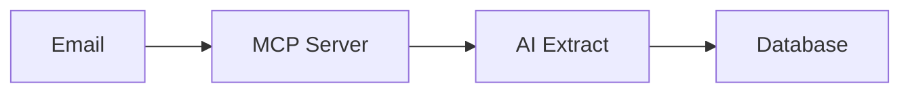
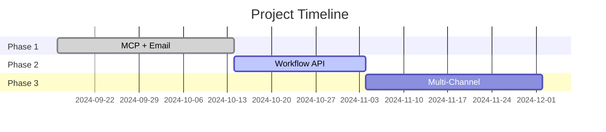

# How to Convert Planning Documents to Presentations

This guide helps you convert the planning documents into various presentation formats for your team.

---

## 📊 Available Formats

### 1. **PRESENTATION.md** (Ready-to-Use Slides)
- **Format:** Markdown slides (20 slides)
- **Best For:** Technical teams, detailed reviews
- **Converts To:** PowerPoint, Google Slides, PDF

### 2. **EXECUTIVE_SUMMARY.md** (One-Pager)
- **Format:** Executive summary
- **Best For:** Leadership, stakeholders, quick reviews
- **Converts To:** PDF, Word document

### 3. **ROADMAP.md** (Visual Timeline)
- **Format:** Markdown with ASCII art
- **Best For:** Status updates, progress tracking
- **Converts To:** Diagram tools, slides

---

## 🎨 Conversion Methods

### Method 1: Markdown to PowerPoint (Recommended)

**Using Marp (Markdown Presentation Ecosystem)**

1. **Install Marp**
   ```bash
   npm install -g @marp-team/marp-cli
   ```

2. **Convert to PowerPoint**
   ```bash
   marp PRESENTATION.md --pptx -o Pharmacovigilance-Project.pptx
   ```

3. **Convert to PDF**
   ```bash
   marp PRESENTATION.md --pdf -o Pharmacovigilance-Project.pdf
   ```

4. **View in Browser**
   ```bash
   marp PRESENTATION.md --html -o presentation.html
   ```

**Styling:** Add to top of PRESENTATION.md:
```markdown
---
marp: true
theme: default
paginate: true
backgroundColor: #fff
---
```

---

### Method 2: Markdown to Google Slides

**Using md2googleslides**

1. **Install**
   ```bash
   npm install -g md2gslides
   ```

2. **Authenticate with Google**
   ```bash
   md2gslides --auth
   ```

3. **Convert**
   ```bash
   md2gslides PRESENTATION.md --title "Pharmacovigilance Project"
   ```

---

### Method 3: Visual Studio Code Extensions

**Using VS Code Presentation Extensions**

1. **Install Extension:**
   - Open VS Code
   - Install "Markdown Preview Mermaid Support"
   - Install "Marp for VS Code"

2. **Preview:**
   - Open `PRESENTATION.md`
   - Click "Open Preview" (Ctrl+Shift+V)
   - Click "Export Slide Deck" in preview

3. **Export Options:**
   - PDF
   - PowerPoint
   - HTML

---

### Method 4: Manual Copy to PowerPoint/Keynote

**Best for custom styling**

1. **Open PRESENTATION.md**
2. **Copy each slide** (separated by `---`)
3. **Create new slide** in PowerPoint/Keynote
4. **Paste content** and format
5. **Add company branding**

**Tips:**
- Each `# Slide X:` becomes a slide
- Code blocks → Use monospace font
- Tables → Use PowerPoint tables
- Diagrams → Recreate in PowerPoint SmartArt

---

## 🎯 Presentation Formats by Audience

### For Executive Leadership (15-20 min)

**Use These Slides from PRESENTATION.md:**
1. Slide 1: Executive Summary
2. Slide 2: Current Achievement
3. Slide 5: Phase 2 Overview
4. Slide 7: Business Value
5. Slide 9: Budget
6. Slide 12: Risk Management
7. Slide 14: Competitive Advantage
8. Slide 19: Call to Action

**Or Use:** EXECUTIVE_SUMMARY.md (convert to PDF)

---

### For Technical Team (30-45 min)

**Use All Slides from PRESENTATION.md:**
- Complete presentation with technical details
- Live demo included (Slide 15)
- Architecture diagrams (Slide 11)
- Code examples

**Plus:**
- Share DOCUMENT_CLASSIFICATION_GUIDE.md
- Share PHASE2_KICKOFF.md

---

### For Stakeholders (20-30 min)

**Use These Slides:**
1. Slide 1: Executive Summary
2. Slide 2: Current Achievement
3. Slide 4: Roadmap
4. Slide 5: Phase 2 Overview
5. Slide 7: Business Value
6. Slide 9: Budget
7. Slide 13: Success Metrics
8. Slide 15: Demo (optional)
9. Slide 19: Call to Action

---

### For Project Kickoff (30 min)

**Use These Slides:**
1. Slide 2: Current Achievement
2. Slide 5: Phase 2 Overview
3. Slide 6: Technical Details
4. Slide 16: Timeline
5. Slide 17: Getting Started
6. Slide 18: Q&A

**Plus:** Live walkthrough of PHASE2_KICKOFF.md

---

## 📐 Creating Visual Diagrams

### Architecture Diagrams

**Option 1: Use Draw.io**
```
1. Go to https://app.diagrams.net/
2. Copy ASCII diagrams from PRESENTATION.md
3. Recreate as boxes and arrows
4. Export as PNG/SVG
5. Insert into slides
```

**Option 2: Use Mermaid**
```markdown

```

**Option 3: Use Lucidchart**
- Import architecture diagrams
- Professional styling
- Share/embed in presentations

---

### Timeline/Gantt Charts

**Option 1: Use Mermaid Gantt**
```markdown

```

**Option 2: Microsoft Project**
- Export to PowerPoint
- Include in slides

**Option 3: Google Sheets**
- Create Gantt chart
- Share link or embed

---

## 🎨 Styling Tips

### PowerPoint Theme

**Recommended Colors:**
- **Primary:** #2E86AB (Blue)
- **Success:** #06A77D (Green)
- **Warning:** #F77F00 (Orange)
- **Danger:** #D62828 (Red)
- **Background:** #F8F9FA (Light Gray)

### Fonts
- **Titles:** Calibri Bold, 36pt
- **Body:** Calibri Regular, 18pt
- **Code:** Consolas, 14pt

### Layout
- **Title Slide:** Center-aligned
- **Content Slides:** Left-aligned with space for graphics
- **Code Slides:** Full-width code blocks
- **Diagram Slides:** Center large diagram

---

## 📤 Sharing Options

### Option 1: PDF
**Best for: Email distribution**
```bash
marp PRESENTATION.md --pdf -o Project-Presentation.pdf
```

**Pros:** Universal, preserves formatting  
**Cons:** Not editable, large file size

---

### Option 2: PowerPoint
**Best for: Team editing, customization**
```bash
marp PRESENTATION.md --pptx -o Project-Presentation.pptx
```

**Pros:** Editable, widely supported  
**Cons:** May need formatting adjustments

---

### Option 3: Google Slides
**Best for: Collaboration, live presentations**
```bash
md2gslides PRESENTATION.md --title "Pharmacovigilance Project"
```

**Pros:** Real-time collaboration, cloud storage  
**Cons:** Requires Google account

---

### Option 4: HTML/Web
**Best for: Interactive presentations, demos**
```bash
marp PRESENTATION.md --html -o presentation.html
```

**Pros:** Interactive, embeddable, lightweight  
**Cons:** Requires web browser

---

### Option 5: Notion/Confluence
**Best for: Documentation, knowledge base**

1. **Copy markdown directly to Notion/Confluence**
2. **Format headings and tables**
3. **Add embedded diagrams**
4. **Share link with team**

---

## 🎬 Demo Preparation

### For Live Demo (Slide 15)

**Setup (Before Presentation):**
1. Start application: `mvn spring-boot:run`
2. Open Swagger UI: http://localhost:8080/swagger-ui.html
3. Open Postman with prepared requests
4. Prepare sample email content

**Demo Flow:**
1. **Show Swagger** - Browse available endpoints
2. **Execute classify_from_email** - Show request/response
3. **Check database** - Show created event
4. **Show statistics** - Demonstrate analytics
5. **Show MCP tools list** - Demonstrate discoverability

**Backup Plan:**
- Pre-recorded video demo
- Screenshot slides
- Sample JSON responses

---

## 📋 Presentation Checklist

### Before Presentation
- [ ] Convert markdown to desired format
- [ ] Add company logo and branding
- [ ] Test all links and embedded content
- [ ] Prepare demo environment
- [ ] Print handouts (if needed)
- [ ] Test projector/screen sharing
- [ ] Prepare backup formats (PDF + PowerPoint)

### During Presentation
- [ ] Start with executive summary
- [ ] Show Phase 1 achievements
- [ ] Focus on business value
- [ ] Address questions proactively
- [ ] Live demo (if technical audience)
- [ ] End with clear call to action

### After Presentation
- [ ] Share slides with attendees
- [ ] Send follow-up email with links
- [ ] Schedule follow-up meetings
- [ ] Update documentation based on feedback

---

## 🔧 Tools Reference

### Recommended Tools

| Tool | Purpose | Cost | Link |
|------|---------|------|------|
| **Marp** | Markdown → Slides | Free | [marp.app](https://marp.app) |
| **md2gslides** | Markdown → Google Slides | Free | [npm package](https://www.npmjs.com/package/md2gslides) |
| **Draw.io** | Diagrams | Free | [draw.io](https://draw.io) |
| **Mermaid** | Code → Diagrams | Free | [mermaid.js.org](https://mermaid.js.org) |
| **Reveal.js** | Web Presentations | Free | [revealjs.com](https://revealjs.com) |
| **Canva** | Design/Polish | Freemium | [canva.com](https://canva.com) |

---

## 🎯 Quick Start Commands

**Create PowerPoint:**
```bash
marp PRESENTATION.md --pptx -o Project.pptx
```

**Create PDF:**
```bash
marp PRESENTATION.md --pdf -o Project.pdf
```

**Create HTML:**
```bash
marp PRESENTATION.md --html -o index.html
```

**Convert Executive Summary to PDF:**
```bash
pandoc EXECUTIVE_SUMMARY.md -o Executive-Summary.pdf
```

**Create Google Slides:**
```bash
md2gslides PRESENTATION.md --title "Pharmacovigilance Project"
```

---

## 📞 Need Help?

**Presentation Issues:**
- Check Marp documentation: https://marpit.marp.app/
- VS Code Marp extension: https://marketplace.visualstudio.com/items?itemName=marp-team.marp-vscode

**Design Help:**
- PowerPoint templates: Office.com
- Google Slides templates: Google Workspace
- Canva presentation templates

---

## ✅ Final Checklist

Before presenting:
- [ ] Slides converted to presentation format
- [ ] Company branding added
- [ ] Demo environment tested
- [ ] Backup materials prepared
- [ ] Handouts printed (if needed)
- [ ] Questions anticipated and answered
- [ ] Call to action clear
- [ ] Follow-up plan ready

---

**You're ready to present! 🚀**

For questions, refer to the individual planning documents or reach out to the project team.

